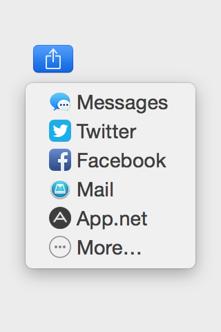

SJADNShareController
=====

###About

`SJADNShareController` can be used to share text only (at the moment) to [App.net](http://app.net), either as part of the sharing menu, on Mountain Lion, or alone.

It uses App.net's web post intent and opens the post box already filled in, in the user's browser, if they are logged in.

The App.net icon used here is a tweaked version of the "appdotnet-icon-share" icon which can be downloaded on the [App.net Developer Assets page](https://account.app.net/legal/assets/).

###Usage

####With NSSharingServicePicker (Mountain Lion only)

If you already have an `NSButton` and suitable `NSSharingServicePicker` code written, simply set your `NSSharingServicePicker`'s delegate to be `SJADNShareController`.

`SJADNShareController *ADNShareController = [[SJADNShareController alloc] init];`

`sharingServicePicker.delegate = ADNShareController;`

Otherwise, [take a look on Stack Overflow to see how to setup a share button, on Mountain Lion](http://stackoverflow.com/a/11815632/447697), then, see the paragraphs above.

####Standalone

Use `shareItems:`. Example:

`SJADNShareController *ADNShareController = [[SJADNShareController alloc] init];`

`[ADNShareController shareItems:[NSArray arrayWithObject:@"Here's some text to share on App.net!"]];`

###TODO

* Currently working on using a [Kiwi](http://kiwi-app.net) URL to post (kiwi://post?text=Hello%20World for example)

##License
Share, make changes, use commercially if you wish. [Crediting "Seb Jachec"](https://twitter.com/iamsebj) would be nice, but is not necessary.